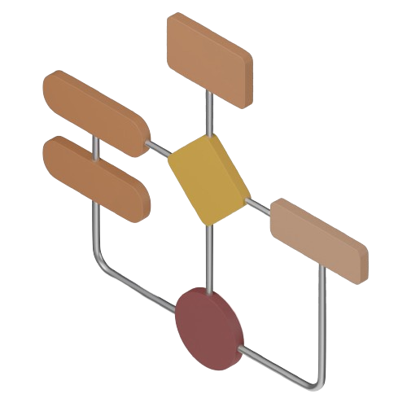

  

<h1 align="center"> Transformers Generative AI </h>

  
  

## Table of Contents

- [Overview](#overview)
- [Generative-artificial-intelligence](#Generative-artificial-intelligence)
- [Integrated-development-environment](#integrated-development-environment)
- [Configuration](#configuration)
- [Credentials](#credentials)

  

